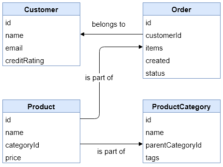
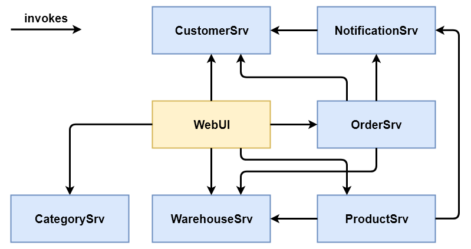

# Service Descriptions v1

This document provides a brief overview of the domain and every service.

## Domain Model



## CustomerSrv

Endpoint: `http://localhost:8000`

This service provides CRUD operations for customer entities as well as an operation to retrieve a refreshed credit rating for a single customer.

```bash
GET     /customers (webshop.customers.resources.CustomerResource)
POST    /customers (webshop.customers.resources.CustomerResource)
DELETE  /customers/{id} (webshop.customers.resources.CustomerResource)
GET     /customers/{id} (webshop.customers.resources.CustomerResource)
PUT     /customers/{id} (webshop.customers.resources.CustomerResource)

GET     /customers/{id}/credit-rating-check (webshop.customers.resources.CustomerResource)
```

## NotificationSrv

Endpoint: `http://localhost:8010`

This service provides operations to send a "marketing mail" with similar product info to a customer or a "new product mail" to the sales department. It also provides operations to retrieve the previously sent mails and to add products to as well as retrieve products from its "new product" database.

```bash
GET     /marketing-mails (webshop.notifications.resources.NotificationResource)
POST    /marketing-mails (webshop.notifications.resources.NotificationResource)
GET     /marketing-mails/{id} (webshop.notifications.resources.NotificationResource)

GET     /product-mails (webshop.notifications.resources.NotificationResource)
POST    /product-mails (webshop.notifications.resources.NotificationResource)
GET     /product-mails/{id} (webshop.notifications.resources.NotificationResource)

GET     /new-products (webshop.notifications.resources.NotificationResource)
POST    /new-products (webshop.notifications.resources.NotificationResource)
GET     /new-products/{id} (webshop.notifications.resources.NotificationResource)
```

## OrderSrv

Endpoint: `http://localhost:8030`

This service provides CRUD operations for order entities including the complicated process to create a new order.

```bash
GET     /orders (webshop.orders.resources.OrderResource)
POST    /orders (webshop.orders.resources.OrderResource)
DELETE  /orders/{id} (webshop.orders.resources.OrderResource)
GET     /orders/{id} (webshop.orders.resources.OrderResource)
PUT     /orders/{id} (webshop.orders.resources.OrderResource)
```

## ProductSrv

Endpoint: `http://localhost:8050`

This service provides CRUD operations for product and product category entities. It also provides operations to get and set the currently available amount of a certain product.

```bash
GET     /categories (webshop.products.resources.ProductResource)
POST    /categories (webshop.products.resources.ProductResource)
DELETE  /categories/{id} (webshop.products.resources.ProductResource)
GET     /categories/{id} (webshop.products.resources.ProductResource)
PUT     /categories/{id} (webshop.products.resources.ProductResource)

GET     /products (webshop.products.resources.ProductResource)
POST    /products (webshop.products.resources.ProductResource)
DELETE  /products/{id} (webshop.products.resources.ProductResource)
GET     /products/{id} (webshop.products.resources.ProductResource)
PUT     /products/{id} (webshop.products.resources.ProductResource)

GET     /products/{id}/availability (webshop.products.resources.ProductResource)
PUT     /products/{id}/availability (webshop.products.resources.ProductResource)
```

## Web UI

Endpoint: `http://localhost:5000`  
The Web UI provides easy read access to the resources of most services.

## Initial Architecture


## Final Architecture

