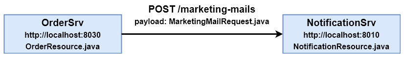

# Exercise 01 - Order Process Changes

## Required Services

The following services are involved and have to be started before the final exercise validation:

- CustomerSrv (`http://localhost:8000`)
- NotificationSrv (`http://localhost:8010`)
- OrderSrv (`http://localhost:8030`)
- ProductSrv (`http://localhost:8050`)

## Description

The `OrderSrv` is responsible for orchestrating the process of creating a new order, which can be invoked via `POST http://localhost:8030/orders`. The current process looks as follows (see the `createOrder()` method in the `webshop.orders.resources.OrderResource` class):

1. The customer's credit rating (1-6) is validated by invoking the `CustomerSrv` via `GET http://localhost:8000/customers/{id}/credit-rating-check (webshop.customers.resources.CustomerResource)`. Ratings of 4 or worse are rejected, ratings of 1-3 are accepted.
2. If the credit rating check was successful, the availability of the requested items is checked via the `ProductSrv`. For each item, `GET http://localhost:8050/products/{id}/availability?amount={amount} (webshop.products.resources.ProductResource)` is invoked. A product counts as `available`, if at least 3 copies would remain in stock after fullfilling the new order.
3. If all requested items are `available`, the order is created and stored via the OrderRepository (`webshop.orders.db.OrderRepository`).

After some research, the sales team has decided that this process should now be adjusted and extended.

## Tasks

1. **Change the credit rating validation logic.** From now on, ratings of 1-4 should be accepted and ratings from 5-6 should be rejected. In short, the worst allowed rating should be increased from 3 to 4. This `CustomerSrv` change has to be performed in the `updateAndCheckCreditRating()` method of the `webshop.customers.resources.CustomerResource` class.
2. **Change the product availability validation logic.** From now on, at least 2 copies of the ordered product have to remain in stock after fulfilling the new order for the product to count as `available`. In short, the minimal remaining amount should be decreased from 3 to 2. This `ProductSrv` change has to be performed in the `checkProductAvailability()` method of the `webshop.products.resources.ProductResource` class.
3. **Add a new final process step.** After creating a new order and before returning the final response, the `NotificationSrv` should be invoked to send a marketing mail with similar products to the customer via `POST http://localhost:8010/marketing-mails`. Use the provided Jersey `restClient` instance for this. As request payload, you have to create an instance of `webshop.orders.api.MarketingMailRequest`. A code example and a diagram are provided below. This `OrderSrv` change has to be performed in the `createOrder()` method of the `webshop.orders.resources.OrderResource` class.

```java
// Invoking the NotificationSrv to send a SIMILAR_PRODUCTS_MAIL for the new order
MarketingMailRequest marketingMailRequest = new MarketingMailRequest("SIMILAR_PRODUCTS_MAIL", createdOrder);

Invocation.Builder request = restClient.target(notificationSrvUrl).request();
request.post(Entity.json(marketingMailRequest), BaseResponse.class);
```



## Validation

When you are finished with all tasks, make sure all required services (see [Required Services](#required-services)) and the exercise validation UI is up and running (if not, execute `exercise-validation/build-and-run-validation-ui.sh`) and then navigate to `http://localhost:5001`. Click on `Exercise 01` and then on `Start Validation`. If every check is successful (`status: true`), pause your stopwatch and notify an experiment admin to write down your time.