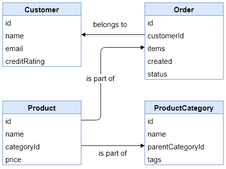
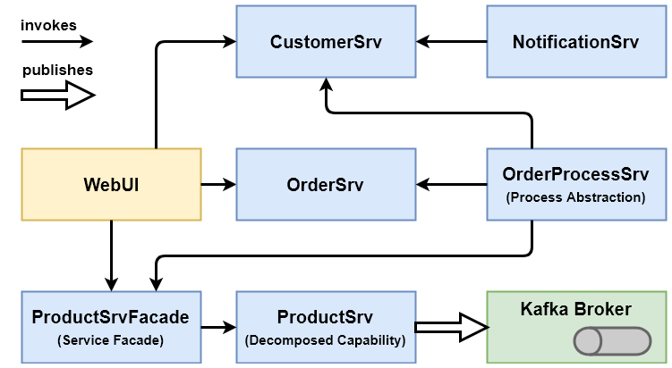

# Service Descriptions v2

This document provides a brief overview of the domain and every service.

## Domain Model



## CustomerSrv

Endpoint: `http://localhost:8000`

This service provides CRUD operations for customer entities as well as an operation to retrieve a refreshed credit rating for a single customer.

```bash
GET     /customers (webshop.customers.resources.CustomerResource)
POST    /customers (webshop.customers.resources.CustomerResource)
DELETE  /customers/{id} (webshop.customers.resources.CustomerResource)
GET     /customers/{id} (webshop.customers.resources.CustomerResource)
PUT     /customers/{id} (webshop.customers.resources.CustomerResource)

GET     /customers/{id}/credit-rating-check (webshop.customers.resources.CustomerResource)
```

## NotificationSrv

Endpoint: `http://localhost:8010`

This service provides operations to send a "marketing mail" with similar product info to a customer or a "new product mail" to the sales department. It also provides operations to retrieve the previously sent mails and to add products to as well as retrieve products from its "new product" database.

```bash
GET     /marketing-mails (webshop.notifications.resources.NotificationResource)
POST    /marketing-mails (webshop.notifications.resources.NotificationResource)
GET     /marketing-mails/{id} (webshop.notifications.resources.NotificationResource)

GET     /product-mails (webshop.notifications.resources.NotificationResource)
POST    /product-mails (webshop.notifications.resources.NotificationResource)
GET     /product-mails/{id} (webshop.notifications.resources.NotificationResource)

GET     /new-products (webshop.notifications.resources.NotificationResource)
POST    /new-products (webshop.notifications.resources.NotificationResource)
GET     /new-products/{id} (webshop.notifications.resources.NotificationResource)
```

## OrderProcessSrv

Endpoint: `http://localhost:8020`

This orchestration service provides a single operation for starting the complicated process to create a new order with all included validations and follow-up actions.

```bash
POST    /order-process (webshop.orderprocess.resources.OrderProcessResource)
```

## OrderSrv

Endpoint: `http://localhost:8030`

This service provides CRUD operations for order entities, but is not responsible for the order process (this is handled by the OrderProcessSrv.

```bash
GET     /orders (webshop.orders.resources.OrderResource)
POST    /orders (webshop.orders.resources.OrderResource)
DELETE  /orders/{id} (webshop.orders.resources.OrderResource)
GET     /orders/{id} (webshop.orders.resources.OrderResource)
PUT     /orders/{id} (webshop.orders.resources.OrderResource)
```

## ProductSrvFacade

Endpoint: `http://localhost:8040`

This facade shields the ProductSrv from all consumers. It merely acts as an intermediate proxy that forwards requests.

```bash
GET     /categories (webshop.products.resources.ProductFacadeResource)
POST    /categories (webshop.products.resources.ProductFacadeResource)
DELETE  /categories/{id} (webshop.products.resources.ProductFacadeResource)
GET     /categories/{id} (webshop.products.resources.ProductFacadeResource)
PUT     /categories/{id} (webshop.products.resources.ProductFacadeResource)

GET     /products (webshop.products.resources.ProductFacadeResource)
POST    /products (webshop.products.resources.ProductFacadeResource)
DELETE  /products/{id} (webshop.products.resources.ProductFacadeResource)
GET     /products/{id} (webshop.products.resources.ProductFacadeResource)
PUT     /products/{id} (webshop.products.resources.ProductFacadeResource)

GET     /products/{id}/availability (webshop.products.resources.ProductFacadeResource)
PUT     /products/{id}/availability (webshop.products.resources.ProductFacadeResource)
```

## ProductSrv

Endpoint: `http://localhost:8050`

This service provides CRUD operations for product and product category entities. It also provides operations to get and set the currently available amount of a certain product. When a new product is created, it publishes an event (basically the newly created product instance) to Apache Kafka (`new-products` topic).

```bash
GET     /categories (webshop.products.resources.ProductCategoryResource)
POST    /categories (webshop.products.resources.ProductCategoryResource)
DELETE  /categories/{id} (webshop.products.resources.ProductCategoryResource)
GET     /categories/{id} (webshop.products.resources.ProductCategoryResource)
PUT     /categories/{id} (webshop.products.resources.ProductCategoryResource)

GET     /products (webshop.products.resources.ProductResource)
POST    /products (webshop.products.resources.ProductResource)
DELETE  /products/{id} (webshop.products.resources.ProductResource)
GET     /products/{id} (webshop.products.resources.ProductResource)
PUT     /products/{id} (webshop.products.resources.ProductResource)

GET     /products/{id}/availability (webshop.products.resources.WarehouseResource)
PUT     /products/{id}/availability (webshop.products.resources.WarehouseResource)
```

## Web UI

Endpoint: `http://localhost:5000`

The Web UI provides easy read access to the resources of most services.

## Initial Architecture



## Final Architecture

