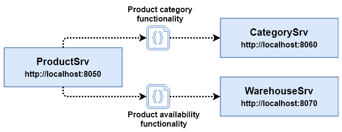

# Exercise 02 - Decomposing the ProductSrv

## Required Services

The following services are involved and have to be started before the final exercise validation:

- CustomerSrv (`http://localhost:8000`)
- NotificationSrv (`http://localhost:8010`)
- OrderProcessSrv (`http://localhost:8020`)
- OrderSrv (`http://localhost:8030`)
- ProductSrvFacade (`http://localhost:8040`)
- ProductSrv (`http://localhost:8050`)
- CategorySrv (`http://localhost:8060`)
- WarehouseSrv (`http://localhost:8070`)
- WebUI (`http://localhost:5000`)

## Description

The `ProductSrv` has grown over time and is now fairly large compared to the other services. It is responsible for several different entities, namely products, product categories, and the available amount of product copies in the warehouse. The following resources are currently provided:

```bash
# Product category resources
GET     /categories (webshop.products.resources.ProductCategoryResource)
POST    /categories (webshop.products.resources.ProductCategoryResource)
DELETE  /categories/{id} (webshop.products.resources.ProductCategoryResource)
GET     /categories/{id} (webshop.products.resources.ProductCategoryResource)
PUT     /categories/{id} (webshop.products.resources.ProductCategoryResource)

# Product resources
GET     /products (webshop.products.resources.ProductResource)
POST    /products (webshop.products.resources.ProductResource)
DELETE  /products/{id} (webshop.products.resources.ProductResource)
GET     /products/{id} (webshop.products.resources.ProductResource)
PUT     /products/{id} (webshop.products.resources.ProductResource)

# Warehouse resources for product availability
GET     /products/{id}/availability (webshop.products.resources.WarehouseResource)
PUT     /products/{id}/availability (webshop.products.resources.WarehouseResource)
```

The lead developer has decided to split up the `ProductSrv` to increase maintainability and scaling efficiency. Two new services will be created: A `CategorySrv` handling product categories and a `WarehouseSrv` responsible for product availability. The CRUD operations related to products will remain in the `ProductSrv`. Runnable skeleton projects for the new services have already been created, they just provide no resources yet.

Since this change has been expected some months ago, precautions have been taken. First, the different capabilities of the `ProductSrv` have already been decomposed in separate classes (one `Resource` and one `Repository` class per capability). And second, the `ProductSrvFacade` shields the `ProductSrv` from all consumers so that it will be the only component that has to be adjusted with the new URLs.



## Tasks

1. **Move the product category related functionality.** Move all functionality related to product categories (see above) from the `ProductSrv` to the new `CategorySrv`. It already has a resource class (`webshop.categories.resources.ProductCategoryResource`) and a repository class (`webshop.categories.db.ProductCategoryRepository`) that have to be replaced (you have to adjust the package name of the copied file though). All necessary model classes are already present in `webshop.categories.api` (you simply have to adjust the import statements in the copied files). Be sure to also remove the instantiation of the now missing functionality from the `ProductSrv`, i.e. from the `run()` method of the `webshop.products.ServiceApplication` class.
2. **Move the product availability related functionality.** Move all functionality related to product availability (see above) from the `ProductSrv` to the new `WarehouseSrv`. It already has a resource class (`webshop.warehouse.resources.WarehouseResource`) and a repository class (`webshop.warehouse.db.WarehouseRepository`) that have to be replaced (you have to adjust the package name of the copied file though). All necessary model classes are already present in `webshop.warehouse.api` (you simply have to adjust the import statements in the copied files). Be sure to also remove the instantiation of the now missing functionality from the `ProductSrv`, i.e. from the `run()` method of the `webshop.products.ServiceApplication` class.
3. **Fix the `ProductSrvFacade`.** Since we moved functionality to new endpoints, we need to adapt the invocation URLs for service consumers. This can be done centrally at the `ProductSrvFacade` in the `webshop.products.resources.ProductFacadeResource`. Endpoint variables for the new services already exist. For category and warehouse operations, these new endpoint variables have to be used when building the HTTP requests.

## Validation

When you are finished with all tasks, make sure all required services (see [Required Services](#required-services)) and the exercise validation UI is up and running (if not, execute `exercise-validation/build-and-run-validation-ui.sh`) and then navigate to `http://localhost:5001`. Click on `Exercise 02` and then on `Start Validation`. If every check is successful (`status: true`), pause your stopwatch and notify an experiment admin for the manual validation part and to write down your time.